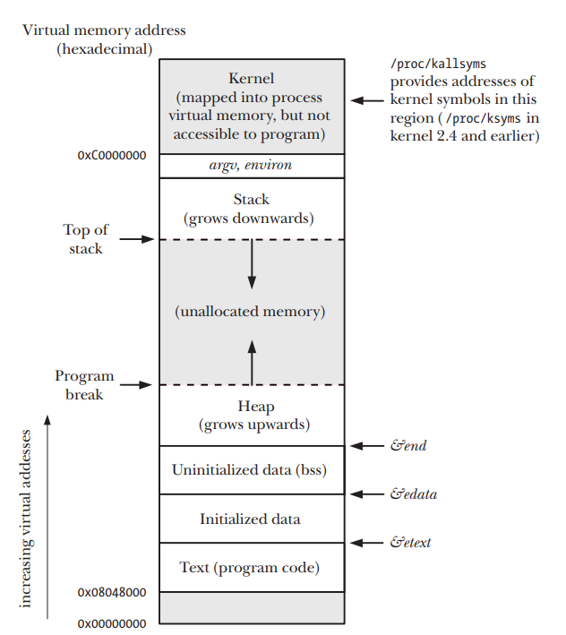
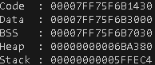
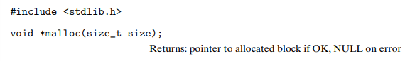
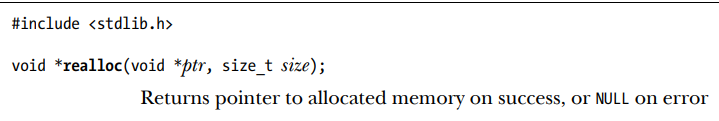
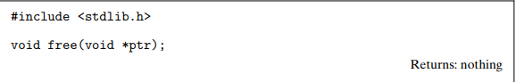
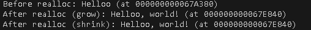
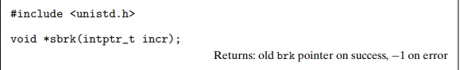

# **Memory Management and Tools**

By: Ritvik Sharma   
University of Otago   
BSC (Computer Science)


Memory management is a cornerstone of system performance, reliability, and security, yet it often remains a riddle for many programmers. Memory Management can seem daunting at first, but if we break down it’s actually quite  a simple and elegant process.This article explores how memory is organized, allocated, and managed in Linux systems, with practical demonstrations using C. We’ll cover the virtual memory layout of a process, dynamic memory allocation, glibc’s malloc internals, and essential debugging tools like valgrind, gdb, and strace. I’ll also sprinkle in a bit of pointer manipulation, which will be helpful for directly accessing and manipulating memory. By the end, you’ll have a clearer understanding of how your programs use memory and how to optimize them effectively.

## **Introduction**
We all know that anything stored on a computer occupies memory, either on a storage drive or in RAM (Random Access Memory). Without the ability to store information—variables, files, and so on—we wouldn’t be able to run programs properly!
A computer has many different memory components, such as CPU registers, caches, RAM, and storage drives. All of these act as containers for storing data, but they differ in how long the stored values last. For example, CPU registers and RAM are volatile, meaning they hold data temporarily and lose it when the computer is turned off. In contrast, storage drives are non-volatile, retaining files and information permanently.
We can think of memory as a switchboard with addresses, where each address can store information. Inside the computer, memory is further divided into different regions and how the concept of virtual memory is used, which we will explore later. The common way of representing a memory address is in hexadecimal notation, where each digit represents 4 bits (remember 1 byte = 8 bits of information).   

Look at this simple C program to print the address of a variable: 
```
#include <stdio.h>

int main(void){
    int x = 10;
    int* px = &x; // Holds address of variable
    printf("Address of variable is: %p and value is %d", (void *)px, *px); // dereference pointer to get value
    return 0;
}

```
Output:  
  

The output shows us the memory address of the variable. An interesting point is that this address is virtual, meaning it isn’t the actual physical location in RAM where the variable is stored. Instead, it’s mapped by the operating system to allow multiple programs to run simultaneously without memory conflicts. This is the essence of virtual memory, which we will explore in more detail shortly.

## **Memory Layout of a Process**
A computer runs multiple processes at once while it is powered on. When the user initiates shutdown, the OS terminates processes and safely turns off the system. When the computer is on, each process is a separate running entity of a program with its own memory area assigned to it, making it seem like it is the only program running (Power of  Memory). Memory is allocated to a process and this memory is divided into separate segments which are as follows:  

**Text Segment:** This segment contains machine instructions of the program that is being run. This section of memory is read only so no accidental modifications occur.  

**Initialized Data Segment:** Contains global and static variables that are initialized and given a value. The values are read from the instructions and loaded into memory.  

**Uninitialized Data Segment (BSS segment):** Contains global and static variables that are uninitialized and given the value 0.  

**Stack:** It holds the local variables in a program (also called automatic variables), function arguments, and return values. Its size is dynamic as the lifetime of variables vary. It follows the LIFO principle, and is fast because of the simple push/pop operations.  

**Heap:** Memory for variables that are initialized during run time. The top end of the heap is called the program break. For example ,the malloc, realloc, and calloc functions in C allocate memory in the heap.  

It is interesting to note that multiple processes of the same program can share the same specific memory segments if given permission. It is important to introduce the idea of parent and children processes now. The parent process is the original process, while the child process is a copy of the original process. This is a very efficient procedure, as the amount of memory needed is reduced drastically as a huge amount of processes are being run on a computer at a given time. By default, only the text segment is shared, but to explicitly share memory regions we can use mmap/shmget to do so (We will cover this later).



## **Dynamic Memory Allocation**
Heap memory's main function is dynamic memory allocation, which offers a flexible memory pool for data whose size is unknown at compile time or that must endure past the function's lifetime. In C, using a dynamic memory allocator is of great use when required to acquire additional virtual memory for a program. Details vary from system to system, but without loss of generality, we will assume that the heap is an area of demand-zero memory that begins immediately after the uninitialized data area and grows upward (toward higher addresses). We can illustrate this with the help of another example that examines memory segments of a C program.

```
#include <stdio.h>
#include <stdlib.h>

int global_uninit; // in .bss
int global_init = 42; // in data

int main(void){
    int local = 1;
    char* heap = malloc(10);

    if(heap == NULL){ // check if memory is properly allocated
        return 1;
    }

    printf("Code  : %p\n", (void*)main);
    printf("Data  : %p\n", (void*)&global_init);
    printf("BSS   : %p\n", (void*)&global_uninit);
    printf("Heap  : %p\n", (void*)heap);
    printf("Stack : %p\n", (void*)&local);

    free(heap); // IMPORTANT: Free memory to avoid memory leaks

    return 0;
}

```
Output:  

An allocator maintains the heap as a collection of various-size blocks. Each block is a contiguous chunk of virtual memory that is either allocated or free.


There are two types of memory allocators which are:
**Explicit Allocators**
are allocators that requires the application to explicitly free any allocated blocks. In C while calling malloc() we must also call free() after we are done.
**Implicit Allocators**
are which that requires the allocator to detect when an allocated block is no longer being used by the program and then free the block. Implicit allocators are also known as garbage collectors. For example in some higher level programming languages like Lisp, Java they have a garbage collection system to free unused memory blocks which we will cover in a later part :D.
Now let's dive deeper in malloc() and free() functions in C. 
These functions are part of the standard library in C (<stdlib.h>) and very powerful functions but require caution while using them.  
**Malloc:** 
This function returns a void pointer to the start of the memory allocated on the heap. It takes in a number which specifies the number of bytes required.  
  
 In 32-bit mode, malloc returns a block whose address is always a multiple of 8. In 64-bit mode, the address is always a multiple of 16. Malloc does not initialize the memory it returns. Applications that want initialized dynamic memory can use calloc(), a thin wrapper around the malloc function that initializes the allocated memory to zero. Realloc() is a function which handles requests to add more memory.  
  
**Free:**
Programs free allocated heap blocks by calling the free function. When a process terminates, all of its memory is returned to the system, including heap memory allocated by functions in the malloc package. 
It is generally good  practice to free a block of memory that you used immediately after when you don't need it.  
  
Using these functions:  
```
#include <stdio.h>
#include <stdlib.h>
#include <string.h>

int main() {
    char *p = malloc(10);
    if (p == NULL){
        perror("malloc failed");
        return 1;
    }
    const char* wrd = "Helloo";
    strcpy(p, wrd);

    printf("Before realloc: %s (at %p)\n", p, p);

    // grow block
    p = realloc(p, 50);
    if (p == NULL){
        perror("Realloc failed");
        return 1;
    }
    strcat(p, ", world!");
    printf("After realloc (grow): %s (at %p)\n", p, p);

    // shrink block
    p = realloc(p,  strlen(p) + 1);
    if (p == NULL){
        perror("realloc failed");
        return 1;
    }
    printf("After realloc (shrink): %s (at %p)\n", p, p);

    free(p);
    p = NULL;
    return 0;
}

```
Output:  
  
It is interesting to note internally malloc() and free() used brk() and sbrk() to perform memory operations but are now mostly deprecated. Now for small to medium allocations they are still used, but for large memory allocation mmap() is used. Let’s take a look at these functions shall we.  

**Brk and Sbrk:**   
To refresh our memory, we can redefine the brk pointer which is basically the end of the heap for virtual memory for a certain process. The purpose of the brk() function is to set the program break to the address it is given. If successful it either grows or shrinks so the end is the address given.
If you pass a higher address, the kernel allocates more pages to your process (heap grows upward).
If you pass a lower address, the kernel releases memory (heap shrinks).
The address must be a valid address after the end of the BSS segment and properly aligned (page boundaries internally).
Sbrk() is basically a wrapper around break which adds the memory automatically to brk().  
   
The problem with this approach is fragmentation: small blocks freed in the middle of the heap create holes that cannot be returned to the operating system, leading to wasted space (external fragmentation). Additionally, each allocation is rounded to alignment boundaries, which wastes a few bytes per block (internal fragmentation). Because the heap can only shrink at the very top, memory in the middle often stays unusable. To handle this more efficiently, modern allocators use mmap for large allocations since it creates independent memory regions that can be released back to the OS, while still using brk/sbrk for small allocations. This hybrid strategy reduces fragmentation and improves memory management.
Since we are praising mmap() so much, let's take a look at it!  
**Mmap:**  
mmap() is a system call that maps memory directly into a process’s virtual address space, either from a file or as anonymous memory for dynamic allocation. Unlike brk() and sbrk(), which can only grow or shrink a single contiguous heap region, mmap can create independent memory regions anywhere in the virtual address space. This allows large allocations to be safely isolated, returned to the operating system with munmap(), and reduces fragmentation issues.   
  

The bottom line is that modern memory allocators, such as glibc’s malloc, typically use brk/sbrk for small to medium allocations and mmap for large blocks, combining the efficiency of a contiguous heap with the flexibility and safety of independent memory mappings. There are many other memory allocation functions but these are the core functions that are used most commonly.

## **Under the hood of malloc and free:**  

Let’s see what happens under the hood when we call these memory functions. Any practical allocator needs some data structure that allows it to distinguish block boundaries and to distinguish between allocated and free blocks. Most allocators embed this information in the blocks themselves. A typical block consists of a one-word header, the payload, and some additional padding. The header encodes the block size (including the header and any padding) as well as whether the block is allocated or free.
The header is followed by the payload that the application requested when it calls malloc(). The payload is followed by a chunk of unused padding that can be any size. There are a number of reasons for the padding. . For example, the padding might be part of an allocator’s strategy for combating external fragmentation. Or it might be needed to satisfy the alignment requirement.  

  

When a program requests **n** bytes of memory, the allocator searches the free list for a free block that is large enough to hold the requested block. The manner in which the allocator performs this search is determined by the placement policy.   
Types of placement policies:

**Best Fit:** First fit searches the free list from the beginning and chooses the first free block that fits. 

**Next Fit:**  Next fit is similar to first fit, but instead of starting each search at the beginning of the list, it starts each search where the previous search left off
Once the allocator has located a free block that fits, it must make another policy decision about how much of the free block to allocate.  
**a.)**  Using the entire free block introduces internal fragmentation. If the placement policy tends to produce good fits, then some additional internal fragmentation might be acceptable.  
**b.)** If the fit is not good, then the allocator will usually opt to split the free block into two parts. The first part becomes the allocated block, and the remainder becomes a new free block.  
If the allocator can’t find a free block with enough space to handle the request it will coalesce free blocks until the desired space is reached. If this fails, the allocator will ask the kernel for more heap memory using the sbrk() function. The allocator transforms the additional memory into one large free block, inserts the block into the free list, and then places the requested block in this new free block

## **Conclusion**
We need dynamic memory because programs often require flexible memory allocation that cannot be determined at compile-time. It allows us to efficiently use memory, create data structures like linked lists, trees, and graphs, and handle varying amounts of data during runtime. Without dynamic memory, programs would be limited to fixed-size arrays and static allocations, which can waste memory or fail when data exceeds the predetermined size. Proper memory management ensures efficient use of resources, prevents memory leaks, and maintains program stability. However, with great power comes great responsibility—we must be careful when using memory operations. By understanding how memory works and looking behind the scenes, we can deepen our understanding of computers and become better programmers.
